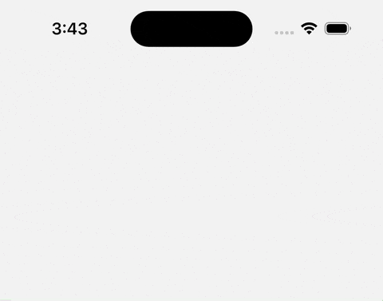

# 🚀 react-native-nitro-toast

A lightweight, native-powered toast notification library for React Native, built with SwiftUI (iOS) and Jetpack Compose (Android). Designed for performance, native feel, and simplicity.

> ❗ If you need fully customizable layouts using JSX (e.g., image, input, custom buttons), consider using a JavaScript-based solution like [`react-native-toast-message`](https://github.com/calintamas/react-native-toast-message) instead.

---

## 📸 Preview
### 🔔 Alert Style (Default)


> 🔥 Seamless native toasts with smooth animations on both iOS and Android.

---

## ✨ Features

- ✅ Fully native: SwiftUI (iOS) & Jetpack Compose (Android)
- ✅ Multiple styles: `stacked`, `alert`
- ✅ Supports `success`, `error`, `info`, `warning` and `default` types
- ✅ Auto-dismiss with configurable duration
- ✅ Show at `top` or `bottom`
- ✅ Small footprint — optimized for React Native libraries
- ✅ Safe area-aware
- ✅ Optional background opacity control
- ⚡ Built using NitroModules (no bridge)

---

## 📦 Installation

```bash
npm install react-native-nitro-toast
# or
yarn add react-native-nitro-toast
```

---

## 🔧 Usage

### Show a simple toast:

```tsx
import { showToast } from 'react-native-nitro-toast';

showToast('Upload completed!', {
  type: 'success',
  position: 'top',
  duration: 3000
});
```

---

## 🛠 Config Options

| Prop             | Type                         | Default     | Description                                |
|------------------|------------------------------|-------------|--------------------------------------------|
| `type`           | `success`, `error`, `info`, `warning`, `default` | `'default'` | Predefined visual styles                   |
| `title`          | `string`                     | `null`      | Optional title                             |
| `titleColor`     | `string` (HEX)               | Varies by type      | Custom title color (optional)              |
| `message`        | `string`                     | (required)  | Toast message                              |
| `messageColor`   | `string` (HEX)               | Varies by type      | Custom message color (optional)            |
| `duration`       | `number` (MS)                | `4000`      | Auto-dismiss duration                      |
| `position`       | `'top'` \| `'bottom'`        | `'bottom'`  | Toast position                             |
| `presentation`   | `'stacked'` \| `'alert'`     | `'alert'`   | Display style                              |
| `backgroundColor`| `string` (HEX)               | Varies by type | Custom background                       |                      |
| `useOverlay`     | `boolean`                    | `true`      | Apply semi-transparent overlay             |

---

## 🧰 Development

Built with:

- [NitroModule](https://nitro.margelo.com/) (no JS bridge) 
- SwiftUI (iOS 14+)
- Jetpack Compose
- Kotlin + Swift

---

## 🧩 Roadmap

- [ ] Support new Glass effect for iOS
- [ ] Add progress indicator support
- [ ] Add customizable icon support
- [ ] Auto-dismiss pause on tap

---

## 💬 Feedback / Issues

Please file issues or feature requests at [GitHub Issues](https://github.com/kiethuynh0904/react-native-nitro-toast/issues).

PRs welcome 🚀

---

## 👨‍💻 Author

Made with ❤️ by Kiet Huynh

---

## 📝 License

[MIT](./LICENSE)