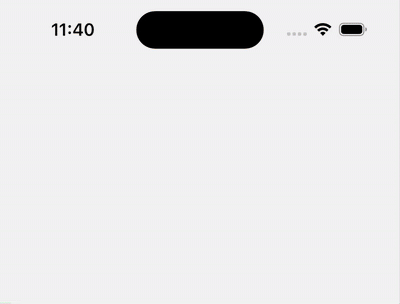
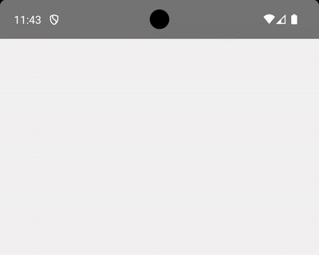

[](https://www.npmjs.com/package/react-native-nitro-toast)
[](https://github.com/kiethuynh0904/react-native-nitro-toast/blob/master/LICENSE)
[](https://www.npmjs.com/package/react-native-nitro-toast)

# 🚀 react-native-nitro-toast

A lightweight, native-powered toast notification library for React Native, built with SwiftUI (iOS) and Jetpack Compose (Android). Designed for performance, native feel, and simplicity.

> ⚠️ **Looking for full layout customization (e.g. JSX content)?**  
> consider using a JavaScript-based solution like [`react-native-toast-message`](https://github.com/calintamas/react-native-toast-message) instead.

## 📸 Preview

### 🔔 Alert Style (Default)



<details>
<summary>🟢 Android</summary>


</details>

> 🔥 Native animations with ultra-smooth transitions on both platforms.

## ✨ Features

- ⚡ **100% Native UI** — SwiftUI & Jetpack Compose
- 🔄 **Two Display Styles**: `alert` and `stacked`
- 🌈 **Predefined Types**: `success`, `error`, `info`, `warning`, `default`
- 🎨 **Highly Customizable**:
  - Position: `top` / `bottom`
  - Duration-based or sticky
  - Color overrides (`titleColor`, `messageColor`, `backgroundColor`)
  - [Custom icon support](./docs/CUSTOM_ICON.md) (via `iconUri`)
  - Optional haptic feedback
  - Safe area aware
- 🤏 **Small Footprint** — zero bridge, TurboModule-native
- 🚀 **Smooth Transitions** — native enter/exit animations
- ✋ **Gesture Dismissal** (swipe to dismiss)
- 🔕 **Auto Dismiss Pause** when holding

## 📋 Requirements

> This package uses [NitroModules](https://nitro.margelo.com/).  
> Please confirm your setup meets the [minimum requirements](https://nitro.margelo.com/docs/minimum-requirements).

### System Requirements
- React Native: **≥ 0.75.0**
- iOS: **Xcode ≥ 16.0**
- Android: API 21+

## 📦 Installation

Refer to the [INSTALLATION.md](./docs/INSTALLATION.md) guide for full setup, including iOS & Android instructions.

## 🔧 Quick Start

```tsx
import { showToast } from 'react-native-nitro-toast';

// Basic usage
showToast('Upload completed!');

// Advanced usage
showToast('Upload completed!', {
  type: 'success',
  position: 'top',
  duration: 3000,
  title: 'Success',
  backgroundColor: '#4CAF50',
  messageColor: '#FFFFFF',
  haptics: true
});
```

## 📚 Guides

- **[Custom Icons](./docs/CUSTOM_ICON.md)**: Learn how to use `react-native-vector-icons` or local images.
- **[Stacked Toasts](./docs/stacked.md)**: See how to manage multiple queued toasts.


## 🛠 Configuration Options

| Prop             | Type                         | Default     | Description                                |
|------------------|------------------------------|-------------|--------------------------------------------|
| `type`           | `success`, `error`, `info`, `warning`, `default` | `'default'` | Predefined visual styles                   |
| `message`        | `string`                     | (required)  | Toast message                              |
| `title`          | `string`                     | `null`      | Optional title                             |
| `duration`       | `number` (MS)                | `4000`      | Auto-dismiss duration (0 for sticky)       |
| `position`       | `'top'` \| `'bottom'`        | `'bottom'`  | Toast position                             |
| `presentation`   | `'stacked'` \| `'alert'`     | `'alert'`   | `alert`: single toast. `stacked`: queue multiple toasts. |
| `haptics`        | `boolean`                    | `false`     | Enable haptic feedback (requires `VIBRATE` permission on Android) |
| `iconUri`        | `string` (URI)               | `undefined` | Custom icon image URI. |
| `backgroundColor`| `string` (HEX)               | Varies by type | Custom background                       |
| `titleColor`     | `string` (HEX)               | Varies by type      | Custom title color (optional)              |
| `messageColor`   | `string` (HEX)               | Varies by type      | Custom message color (optional)            |
| `useOverlay`     | `boolean`                    | `true`      | Apply semi-transparent overlay             |

---

## 🧩 Roadmap
- [x] Haptic feedback support
- [x] Add gesture support for dismissal
- [x] Auto-dismiss pause on tap
- [x] Add customizable icon support
- [ ] Support new Glass effect for iOS
- [ ] Add progress indicator support


## 🤝 Contributing & Issues
Contributions are always welcome! If you have an idea, find a bug, or want to help improve the library, please feel free to:
- [Create an issue](https://github.com/kiethuynh0904/react-native-nitro-toast/issues) to report bugs or suggest features.
- [Open a pull request](https://github.com/kiethuynh0904/react-native-nitro-toast/pulls) with your improvements.

## 👨‍💻 Author

Made with ❤️ by [Kiet Huynh](https://github.com/kiethuynh0904)

## 📝 License

[MIT](./LICENSE)
