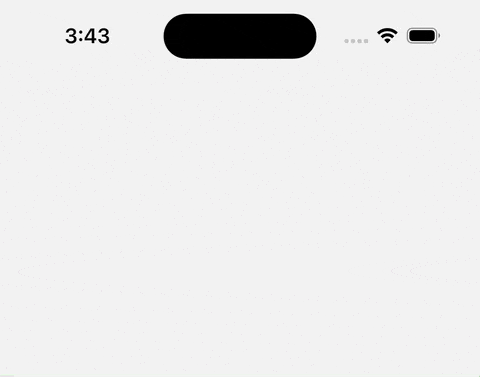
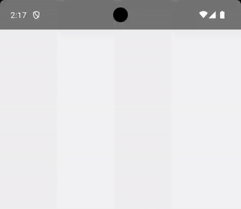

# 🚀 react-native-nitro-toast

A lightweight, native-powered toast notification library for React Native, built with SwiftUI (iOS) and Jetpack Compose (Android). Designed for performance, native feel, and simplicity.

> ⚠️ **Note**: If you need fully customizable layouts using JSX (e.g., image, input, custom buttons), consider using a JavaScript-based solution like [`react-native-toast-message`](https://github.com/calintamas/react-native-toast-message) instead.

## 📸 Preview

### 🔔 Alert Style (Default)



<details>
<summary>🟢 Android</summary>


</details>

> 🔥 Seamless native toasts with smooth animations on both iOS and Android.

## ✨ Features

- ✅ **Fully Native**: Built with SwiftUI (iOS) & Jetpack Compose (Android)
- ✅ **Multiple Styles**: `stacked` and `alert` presentation modes
- ✅ **Toast Types**: `success`, `error`, `info`, `warning` and `default`
- ✅ **Customizable**:
  - Auto-dismiss with configurable duration
  - Position at `top` or `bottom`
  - Background opacity control
  - Custom colors for title and message
- ✅ **Performance**:
  - Small footprint — optimized for React Native libraries
  - Built using NitroModules (no bridge)
- ✅ **User Experience**:
  - Safe area-aware
  - Smooth native animations
  - Native feel on both platforms

## 📦 Installation

```bash
# Using npm
npm install react-native-nitro-toast

# Using yarn
yarn add react-native-nitro-toast

```

## 🔧 Quick Start

```tsx
import { showToast } from 'react-native-nitro-toast';

// Basic usage
showToast('Upload completed!');

// Advanced usage
showToast('Upload completed!', {
  type: 'success',
  position: 'top',
  duration: 3000,
  title: 'Success',
  backgroundColor: '#4CAF50',
  messageColor: '#FFFFFF'
});
```

## 🍱 Presentation Types

- 📚 [Stacked](docs/stacked.md) – Queue-based multiple toast system
- 🔔 Alert – Single toast notification

## 🛠 Configuration Options

| Prop             | Type                         | Default     | Description                                |
|------------------|------------------------------|-------------|--------------------------------------------|
| `type`           | `success`, `error`, `info`, `warning`, `default` | `'default'` | Predefined visual styles                   |
| `title`          | `string`                     | `null`      | Optional title                             |
| `titleColor`     | `string` (HEX)               | Varies by type      | Custom title color (optional)              |
| `message`        | `string`                     | (required)  | Toast message                              |
| `messageColor`   | `string` (HEX)               | Varies by type      | Custom message color (optional)            |
| `duration`       | `number` (MS)                | `4000`      | Auto-dismiss duration                      |
| `position`       | `'top'` \| `'bottom'`        | `'bottom'`  | Toast position                             |
| `presentation`   | `'stacked'` \| `'alert'`     | `'alert'`   | Display style                              |
| `backgroundColor`| `string` (HEX)               | Varies by type | Custom background                       |                      |
| `useOverlay`     | `boolean`                    | `true`      | Apply semi-transparent overlay             |

---

## 🧰 Development

Built with modern technologies:

- [NitroModule](https://nitro.margelo.com/) (no JS bridge)
- SwiftUI (iOS 14+)
- Jetpack Compose
- Kotlin + Swift

## 🧩 Roadmap

- [ ] Support new Glass effect for iOS
- [ ] Add progress indicator support
- [ ] Add customizable icon support
- [ ] Auto-dismiss pause on tap
- [ ] Add gesture support for dismissal

## 🤝 Contributing

PR welcome

## 💬 Feedback & Issues

Found a bug or have a feature request? Please file an issue at [GitHub Issues](https://github.com/kiethuynh0904/react-native-nitro-toast/issues).

## 👨‍💻 Author

Made with ❤️ by [Kiet Huynh](https://github.com/kiethuynh0904)

## 📝 License

[MIT](./LICENSE)