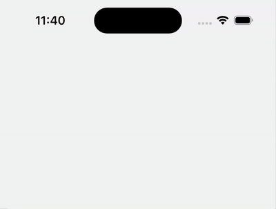
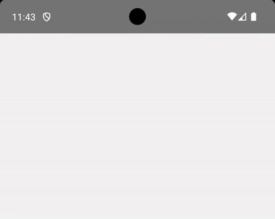

[](https://www.npmjs.com/package/react-native-nitro-toast)
[](https://github.com/kiethuynh0904/react-native-nitro-toast/blob/master/LICENSE)
[](https://www.npmjs.com/package/react-native-nitro-toast)

# 🚀 react-native-nitro-toast

## Why Nitro Toast?

**react-native-nitro-toast** is a lightweight, native-powered toast notification library for React Native, built with SwiftUI (iOS) and Jetpack Compose (Android). It is designed for:

- ⚡ **100% Native UI** — zero bridge, TurboModule-native
- 🚀 **Smooth Animations** — powered by SwiftUI & Compose
- 🎯 **Simple API** — with sensible defaults and full TypeScript support
- 🎨 **Highly Customizable** — override colors, icons, positions, haptics

> ⚠️ **Looking for full layout customization (e.g. JSX content)?**  
> Consider using a JavaScript-based solution like [`react-native-toast-message`](https://github.com/calintamas/react-native-toast-message) instead.

## 📸 Preview

### 🔔 Alert Style (Default)



<details>
<summary>🟢 Android</summary>


</details>

### 🍞 Stacked Presentation

https://github.com/user-attachments/assets/a4ba0016-3b17-4b50-9b58-09357eb10047

Check out the [stacked presentation guide](./docs/stacked.md) for more info.

> 🔥 Native animations with ultra-smooth transitions on both platforms.

## ✨ Features

- **Display modes**: `alert` or `stacked`
- **Predefined Types**: `success`, `error`, `info`, `warning`, `default`, `loading`
- **Promise-based toasts** (loading → success/error)
- **Highly Customizable**:
  - Position: `top` / `bottom`
  - Duration-based or sticky
  - Color overrides (`titleColor`, `messageColor`, `backgroundColor`)
  - [Custom icon support](./docs/CUSTOM_ICON.md) (via `iconUri`)
  - Custom font support (via `fontFamily`)
- **Haptic Feedback Support**
- **Safe-area aware**
- **Gesture Dismissal** (swipe to dismiss)
- **Auto Dismiss Pause** when holding

## 📦 Installation

See the [INSTALLATION.md](./docs/INSTALLATION.md) guide for full setup, requirements, and platform instructions.

## ✅ Compatibility

| | Requirement |
|---|---|
| React Native | **>= 0.78** |
| React | >= 18 |
| `react-native-nitro-modules` | >= 0.35 |
| **New Architecture** | **Required** |
| iOS | >= 15.1 (follows React Native's minimum) · visionOS 1.0 |
| Android | `minSdk` 23 |

> Built on [Nitro Modules](https://nitro.margelo.com), which require React Native's
> **New Architecture**. The legacy bridge (old architecture) is not supported.

## 🔧 Quick Start

Check out the [example app](./example) for a full working demo.

```tsx
import { showToast, dismissToast, dismissAllToasts } from 'react-native-nitro-toast';

// Basic usage
showToast('Upload completed!');

// Advanced usage
showToast('Upload completed!', {
  type: 'success',
  position: 'top',
  duration: 3000,
  title: 'Success',
  backgroundColor: '#4CAF50',
  messageColor: '#FFFFFF',
  haptics: true,
});

// Hide title completely
showToast('Just a message, no title', {
  title: '',
  backgroundColor: '#333',
});

// Manual loading toast (useful for loading or sticky toasts)
const id = showToast('Loading...', { type: 'loading' });
// Dismiss the toast when your async work is done
dismissToast(id);

// Dismiss every visible toast at once
dismissAllToasts();
```

### ⚙️ Global defaults

Set app-wide defaults once (e.g. at startup). They merge on top of the built-in
defaults and below each `showToast` call's own config:

```tsx
import { configure } from 'react-native-nitro-toast';

configure({ position: 'top', haptics: true });
```

### ⏳ Promise-based Toasts

```tsx
import { showToastPromise } from 'react-native-nitro-toast';

// Example: Show a toast for an async upload process
function handleUpload() {
  showToastPromise(
    uploadFile(), // Replace with your async function returning a promise
    {
      loading: 'Uploading your file...',
      success: result => result.message,
      error: error => error instanceof Error ? error.message : 'Upload failed. Please try again.',
    },
    {
      position: 'top',
      haptics: true,
      loading: { title: 'Uploading' },
    }
  );
}
```
## 📚 Guides & Documentation

- **[Custom Icons](./docs/CUSTOM_ICON.md)**: Learn how to use `react-native-vector-icons` or local images.
- **[Stacked Toasts](./docs/stacked.md)**: See how to manage multiple queued toasts.

## 🛠 Configuration Options

| Prop             | Type                         | Default     | Description                                |
|------------------|------------------------------|-------------|--------------------------------------------|
| `type`           | `success`, `error`, `info`, `warning`, `default`, `loading` | `'default'` | Predefined visual styles, including loading indicator |
| `message`        | `string`                     | (required)  | Toast message                              |
| `title`          | `string`                     | `null`      | Optional title. Pass empty string `""` to hide title completely |
| `fontFamily`     | `string`                     | `null`      | Custom font family (e.g. `Rubik, Delius...`)    |
| `duration`       | `number` (MS)                | `4000`      | Auto-dismiss duration (0 for sticky/manual)       |
| `position`       | `'top'` \| `'bottom'`        | `'bottom'`  | Toast position                             |
| `presentation`   | `'stacked'` \| `'alert'`     | `'alert'`   | `alert`: single toast. `stacked`: queue multiple toasts. |
| `haptics`        | `boolean`                    | `false`     | Enable haptic feedback (requires `VIBRATE` permission on Android) |
| `iconUri`        | `string` (URI)               | `undefined` | Custom icon image URI. |
| `backgroundColor`| `string` (HEX)               | Varies by type | Custom background                       |
| `titleColor`     | `string` (HEX)               | Varies by type      | Custom title color (optional)              |
| `messageColor`   | `string` (HEX)               | Varies by type      | Custom message color (optional)            |
| `useOverlay`     | `boolean`                    | `true`      | Apply semi-transparent overlay             |
| `maxWidth`       | `number` (pt/dp)             | `480`       | Max toast width; caps + centers on large screens (iPad/tablet), no-op on phones |

## 🤝 Contributing & Issues
Contributions are always welcome! If you have an idea, find a bug, or want to help improve the library, please feel free to:
- [Create an issue](https://github.com/kiethuynh0904/react-native-nitro-toast/issues) to report bugs or suggest features.
- [Open a pull request](https://github.com/kiethuynh0904/react-native-nitro-toast/pulls) with your improvements.

## 👨‍💻 Author

Made with ❤️ by [Kiet Huynh](https://github.com/kiethuynh0904)

## 📝 Changelog

See [CHANGELOG.md](./CHANGELOG.md) for release notes and version history.

## 📝 License

[MIT](./LICENSE)


