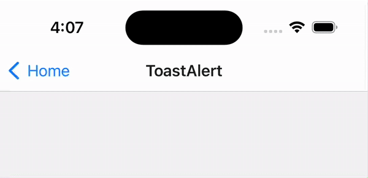

# 🖼️ Custom Icon Guide for react-native-nitro-toast
*Preview: Toast with a custom vector icon*



You can display a custom icon in your toast using the `iconUri` prop. This works great with vector icons or local images.

## Using Vector Icons (`react-native-vector-icons`) - Highly Recommended

First, make sure you have `react-native-vector-icons` installed and configured. You can find the installation guide [here](https://github.com/oblador/react-native-vector-icons#installation). For a complete, working setup, please refer to the `example/` project in this repository.

Thanks to the `getImageSourceSync` API from `react-native-vector-icons`, using vector icons is simple and synchronous.

```tsx
import FontAwesome6 from '@react-native-vector-icons/fontawesome6';
import { showToast } from 'react-native-nitro-toast';

const iconSource = FontAwesome6.getImageSourceSync('solid', 'face-smile', 20, 'white');

showToast('Upload completed!', {
  title: 'Custom Icon',
  iconUri: iconSource?.uri, // Pass the icon URI
  backgroundColor: '#4169E1',
  titleColor: '#FFFFFF',
  messageColor: '#FFFFFF',
  haptics: true,
});
```

**Tips:**
- You can use any icon library from `react-native-vector-icons`.
- Adjust the icon size and color as needed in `getImageSourceSync`.

## Using a Local Image Asset

Using local images (e.g., `.png` files from your `assets` folder) requires an `async` function on Android to copy the asset to a readable file path.

> **Note**: This requires `react-native-fs`. Install it if you haven't: `npm install react-native-fs`

```tsx
import { showToast } from 'react-native-nitro-toast';
import RNFS from 'react-native-fs';
import { Image, Platform } from 'react-native';

// Helper to get a usable file path
async function getLocalIconPath(asset) {
  const source = Image.resolveAssetSource(asset);
  if (Platform.OS === 'ios') {
    return source.uri;
  }

  // On Android, we must copy the asset to cache
  const assetName = source.uri.split('/').pop().split('?')[0];
  const destPath = `${RNFS.CachesDirectoryPath}/${assetName}`;
  
  if (!(await RNFS.exists(destPath))) {
    await RNFS.copyFileAssets(`assets/${assetName}`, destPath);
  }
  
  return `file://${destPath}`;
}

// Usage in an async function
async function showLocalImageToast() {
    const iconUri = await getLocalIconPath(require('./assets/my-icon.png'));

    showToast('With local image', {
        title: 'Local Icon',
        iconUri,
    });
}
```

## Fallback Behavior
- If `iconUri` is not provided, a default icon is shown based on the toast type (`success`, `error`, etc).
- If the image fails to load from the URI, the default icon will be used as a fallback.

## Troubleshooting
- **Vector Icons**: Ensure the icon set and name are correct.
- **Local Images**: On Android, verify that `react-native-fs` has permission and the asset path is correct. Check for the `file://` prefix.

---

Enjoy customizing your toast notifications! 🎨 